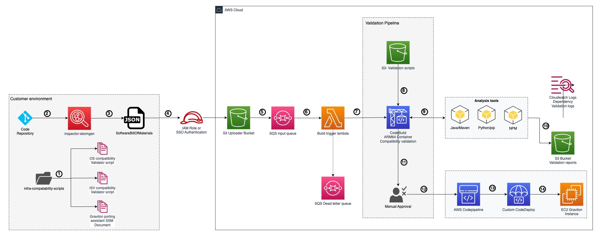

# SBOM Graviton App Dependency Compatibility Tool

## Overview

Migrating from x86 to graviton [arm64] has known benefits like up to 40% better price-performance, up to 20% less expensive, up to 60% less energy consumption in comparison to x86 based servers. Graviton makes an ideal choice for cloud native workloads seeking both economic and environmental benefits.

The migration to AWS Graviton processors follows a structured three-phase approach: Assess, Mobilize, and Migrate & Optimize. Assessment in case of graviton migration needs to be on multiple levels 

Operating system compatibility

ISV software compatibility

Application library dependency compatibility

One of the key challenges in the Assessment phase is discovering and analyzing application compatibility with Graviton. This is done manually as of now which is time consuming and error prone process. To streamline this process, we've developed the Graviton Migration Accelerator tool. It helps in identifying the running application (processes) on a VM/instance, and along with the application dependency file (such as pom.xml, requirements.txt, package.json, etc), it also validates the dependency compatibility on a graviton instance. Meaning, it can highlight the software components that are supported on Graviton, the ones which need upgrade before migrating to Graviton and components that aren't supported on Graviton instances yet.

### Target audience

This solution is designed for:
- **Application architects** planning Graviton migrations
- **DevOps engineers** managing containerized applications
- **Security teams** conducting dependency assessments
- **Development teams** modernizing applications for ARM architecture

### Solution benefits

- **Automated compatibility assessment**: Eliminates manual dependency analysis
- **Multi-language support**: Analyzes Java/Maven, Python/pip, and NPM dependencies
- **AWS-native integration**: Uses AWS Inspector SBOM generator for secure dependency discovery
- **Comprehensive reporting**: Generates detailed Excel and Markdown compatibility reports
- **Cost optimization**: Identifies opportunities for Graviton cost savings
- **Security enhancement**: Leverages AWS security best practices throughout the analysis pipeline

## Architecture

### Solution overview

This solution deploys a serverless, event-driven architecture that automatically processes SBOM files and generates ARM compatibility reports. The architecture follows AWS Well-Architected Framework principles for security, reliability, and cost optimization.



### AWS services used

| Service | Purpose | Configuration |
|---------|---------|---------------|
| **Amazon S3** | SBOM file storage and report distribution | KMS encrypted with lifecycle policies |
| **AWS Lambda** | Event-driven analysis trigger | ARM64 runtime with dead letter queue |
| **AWS CodePipeline** | Workflow orchestration | Multi-stage pipeline with approval gates |
| **AWS CodeBuild** | ARM compatibility analysis execution | ARM64 containers for native testing |
| **Amazon CloudWatch** | Monitoring and logging | Encrypted logs with retention policies |
| **AWS KMS** | Encryption key management | Dedicated keys per service |
| **AWS IAM** | Access control and permissions | Least privilege roles and policies |

### Data flow

The solution follows a 14-step automated workflow for comprehensive Graviton compatibility assessment:

1. **Infra-Compatibility Scripts**: System administrator can run these scripts on the servers to analyze OS, ISV software. 
2. **SBOM Generation**: AWS Inspector SBOM Generator analyzes dependencies and creates CycloneDX-format SBOM file based on the application code
3. **Local Validation**: SBOM file validated locally for completeness and format compliance
4. **S3 Upload**: Authenticate using an IAM role / SSO to upload SBOM file to S3 bucket `dependency/` folder with KMS encryption
5. **S3 Event Trigger**: S3 PutObject event automatically invokes Lambda function
6. **SBOM Parsing**: Lambda function parses SBOM JSON to extract package metadata (types, versions, dependencies)
7. **Pipeline Initiation**: Lambda triggers CodePipeline execution with parsed metadata as parameters
8. **CodeBuild Launch**: CodePipeline starts CodeBuild project on ARM64 (Graviton) compute environment
9. **Dependency Installation**: CodeBuild attempts to install all dependencies on ARM64 architecture
10. **Compatibility Testing**: Automated tests validate:
    - Package installation success/failure
    - Runtime compatibility checks
    - Version-specific ARM support validation
11. **Results Aggregation**: Analysis results compiled with compatibility status for each dependency
12. **Manual Approval**: Based on the report analysis, app teams can approve the downstream deployment pipeline to deploy the app to Graviton based EC2
13. **CodePipeline**: Custom application deployment pipeline will be trigged post approval
14. **CodeDeploy**: AWS CodeDeploy can be customised to deploy application code to Graviton based EC2

### Security features

- **End-to-end encryption**: All data encrypted at rest and in transit using AWS KMS
- **Least privilege access**: IAM roles with minimal required permissions
- **Network isolation**: VPC endpoints for private connectivity (optional)
- **Audit logging**: Comprehensive CloudTrail and CloudWatch logging
- **Secure SBOM generation**: Uses AWS Inspector for trusted dependency discovery

## Prerequisites

### AWS account requirements

- AWS account with administrative permissions
- AWS CLI version 2.0 or later configured with appropriate credentials
- Access to deploy resources in US East 1 (N. Virginia) region
- Sufficient service quotas for Lambda (10 concurrent executions), CodeBuild (5 concurrent builds), and CodePipeline (10 pipelines)

### Required tools

- **Terraform**: Version 1.0.0 or later for infrastructure deployment
- **Git**: For repository management and version control
- **AWS Inspector SBOM Generator**: For offline SBOM generation from application directories

### IAM permissions

Your AWS user or role must have the following permissions:

```json
{
    "Version": "2012-10-17",
    "Statement": [
        {
            "Effect": "Allow",
            "Action": [
                "s3:*",
                "lambda:*",
                "codepipeline:*",
                "codebuild:*",
                "iam:*",
                "kms:*",
                "logs:*",
                "sqs:*"
            ],
            "Resource": "*"
        }
    ]
}
```

## Deployment

### Step 1: Generate SBOM files

Before deploying the infrastructure, generate SBOM files for your applications using the AWS Inspector SBOM generator as an offline tool.
##### ⚠️ Disclaimer: SBOM Generation
   ```
   Please be cautious on generating and storing the SBOMs for production code.
   For more information on SBOM security best practices, refer to:
      - [CISA SBOM Sharing Guidance](https://www.cisa.gov/sbom)
      - [NTIA SBOM Minimum Elements](https://www.ntia.gov/sbom)
```
#### Install AWS Inspector SBOM Generator

1. **Download the SBOM generator**:
   ```bash
   # For Linux/macOS
   curl -LO https://inspector-sbomgen-releases-us-east-1.s3.amazonaws.com/latest/linux/amd64/inspector-sbomgen
   chmod +x inspector-sbomgen
   
   # For Windows
   curl -LO https://inspector-sbomgen-releases-us-east-1.s3.amazonaws.com/latest/windows/amd64/inspector-sbomgen.exe
   ```

2. **Verify installation**:
   ```bash
   ./inspector-sbomgen version
   ```

#### Generate SBOM from application directory

   ```bash
   # Navigate to your Maven project directory
   cd /path/to/your/project
   
   # Generate SBOM from the project directory
   ./inspector-sbomgen dir --path . --output-file sbom.json --format cyclonedx
   ```

### Step 2: Deploy infrastructure with Terraform

#### Initialize and configure Terraform

1. **Clone the repository**:
   ```bash
   git clone https://gitlab.aws.dev/prushok/graviton-migration-acclerator
   cd graviton-migration-acclerator
   ```

2. **Initialize Terraform**:
   ```bash
   terraform init
   ```

3. **Configure variables** (optional):
   ```bash
   # Create terraform.tfvars file for customization
   cat > terraform.tfvars << EOF
   bucket_name = "my-company-graviton-sbom-analyzer"
   EOF
   ```

#### Review and deploy infrastructure

1. **Review the deployment plan**:
   ```bash
   terraform plan
   ```
   
   This will show you all AWS resources that will be created:
   - S3 bucket with KMS encryption
   - Lambda function with dead letter queue
   - CodePipeline with source and build stages
   - CodeBuild project with ARM64 environment
   - IAM roles and policies
   - CloudWatch log groups
   - KMS keys for encryption

2. **Deploy the infrastructure**:
   ```bash
   terraform apply
   ```
   
   Type `yes` when prompted to confirm the deployment.

3. **Verify deployment**:
   ```bash
   # Check Terraform outputs
   terraform output
   
   # Verify S3 bucket creation
   aws s3 ls | grep graviton
   
   # Verify Lambda function
   aws lambda list-functions --query 'Functions[?contains(FunctionName, `graviton`)]'
   ```

#### Terraform outputs

After successful deployment, Terraform will provide the following outputs:

```bash
s3_bucket_name = "graviton-uploader-xy"
lambda_function_name = "sbom-graviton-build-trigger-xy"
codepipeline_name = "sbom-graviton-app-dependency-compatibility-xy"
dependency_upload_path = "s3://graviton-uploader-xy/dependency/"
reports_path = "s3://graviton-uploader-xy/reports/"
```

### Step 3: Upload SBOM and analyze

1. **Upload your generated SBOM file**:
   - Authenticate using an IAM role/ Single Sign On
   - Using AWS Management Console [here](https://docs.aws.amazon.com/AmazonS3/latest/userguide/upload-objects.html#upload-objects-procedure)
   - Using AWS cli, you can make use of below command: 

   ```bash
   # Upload the SBOM file to trigger analysis
   aws s3 cp sbom.json s3://YOUR-BUCKET-NAME/dependency/
   ```

2. **Monitor the analysis**:
   ```bash
   # Check CodePipeline status
   aws codepipeline get-pipeline-state --name YOUR-PIPELINE-NAME
   
   # Monitor Lambda logs
   aws logs tail /aws/lambda/YOUR-LAMBDA-FUNCTION-NAME --follow
   ```

3. **Retrieve results**:
   ```bash
   # List generated reports
   aws s3 ls s3://YOUR-BUCKET-NAME/reports/ --recursive
   
   # Download reports
   aws s3 sync s3://YOUR-BUCKET-NAME/reports/ ./reports/
   ```
### Step 4: Deploying Application

1. **Deploying application**:
   Steps 13,14 show a sample depiction of application deployment to target Graviton EC2. These need to be modified and customized as per the application needs

## Usage

### Understanding the analysis results

The tool generates comprehensive compatibility reports in multiple formats:

#### Excel reports

- **Summary sheet**: High-level compatibility overview with metrics
- **Detailed analysis**: Per-dependency compatibility assessment
- **Recommendations**: Specific actions for incompatible dependencies
- **Native libraries**: List of detected native code dependencies

#### Markdown reports

- **Executive summary**: Business-focused compatibility overview
- **Technical details**: Detailed findings by package manager
- **Migration roadmap**: Step-by-step migration recommendations

### Compatibility categories

| Category | Description | Risk Level | Action Required |
|----------|-------------|------------|-----------------|
| **Compatible** | No known ARM compatibility issues | Low | No action needed |
| **Likely Compatible** | Minor compatibility concerns | Low-Medium | Test on ARM hardware |
| **Native Code** | Contains native libraries | Medium | Verify ARM-specific versions |
| **Incompatible** | Known ARM architecture issues | High | Find alternatives or rebuild |
| **Unknown** | Insufficient compatibility data | Medium | Manual investigation required |

### Best practices for SBOM generation

1. **Generate SBOMs regularly**: Update SBOMs when dependencies change
2. **Include development dependencies**: Use `--include-dev-deps` for comprehensive analysis
3. **Validate SBOM quality**: Ensure all critical dependencies are captured
4. **Version control SBOMs**: Track SBOM changes alongside code changes
5. **Automate generation**: Integrate SBOM generation into CI/CD pipelines

## Troubleshooting

### Common deployment issues

**Terraform deployment fails**:
- Verify AWS credentials and permissions
- Check service quotas in your AWS account
- Ensure unique S3 bucket names
- Review CloudTrail logs for detailed error information

**SBOM generation issues**:
- Verify inspector-sbomgen installation and permissions
- Check network connectivity for downloading dependencies
- Ensure project directory contains valid package files (pom.xml, package.json, requirements.txt)
- Use `--verbose` flag for detailed error information

**Analysis pipeline failures**:
- Check CodeBuild logs in CloudWatch
- Verify SBOM file format using online validators
- Ensure SBOM contains supported package types
- Monitor Lambda function error rates

### Accessing logs and monitoring

**CloudWatch log groups**:
```bash
# Lambda function logs
aws logs describe-log-groups --log-group-name-prefix "/aws/lambda/sbom-graviton"

# CodeBuild logs
aws logs describe-log-groups --log-group-name-prefix "graviton-app-dependency"
```


### Getting support

For technical support:
1. Review AWS Inspector SBOM Generator documentation
2. Check AWS Graviton migration best practices
3. Consult AWS Support for account-specific issues
4. Review solution logs for detailed error information


## Security considerations

### Data protection

- **Encryption at rest**: All S3 objects encrypted with customer-managed KMS keys
- **Encryption in transit**: TLS 1.2+ for all data transfers
- **Access logging**: S3 access logs and CloudTrail for audit compliance
- **Network security**: VPC endpoints available for private connectivity

### Access control

- **IAM roles**: Service-specific roles with least privilege permissions
- **Resource policies**: S3 bucket policies restrict access to authorized services
- **MFA requirements**: Optional MFA enforcement for sensitive operations
- **Cross-account access**: Support for cross-account SBOM analysis

## Additional resources

### AWS documentation

- [AWS Inspector SBOM Generator User Guide](https://docs.aws.amazon.com/inspector/latest/user/sbom-generator.html)
- [AWS Graviton Technical Guide](https://github.com/aws/aws-graviton-getting-started)
- [AWS Well-Architected Framework](https://aws.amazon.com/architecture/well-architected/)

### Related AWS services

- [Amazon Inspector](https://aws.amazon.com/inspector/) - Automated security assessments
- [AWS Graviton](https://aws.amazon.com/ec2/graviton/) - ARM-based processors for EC2
- [AWS CodePipeline](https://aws.amazon.com/codepipeline/) - Continuous integration and delivery

### Community resources

- [AWS Graviton Slack Community](https://aws-graviton.slack.com/)
- [CycloneDX Community](https://cyclonedx.org/community/)
- [SPDX Working Group](https://spdx.dev/participate/)

## Contributing

We welcome contributions to improve this solution:

1. **Fork the repository** and create a feature branch
2. **Follow coding standards** for Terraform and Python
3. **Add tests** for new functionality
4. **Update documentation** for any changes
5. **Submit a pull request** with detailed description

### Development guidelines

- Use Terraform best practices for infrastructure as code
- Follow AWS security best practices
- Include unit tests for Python analysis modules
- Maintain backward compatibility when possible
- Document all configuration options

## License

This project is licensed under the MIT License. See the [LICENSE](LICENSE) file for complete details.

---

**Note**: This solution is provided as-is for educational and demonstration purposes. Always review and test thoroughly before using in production environments.