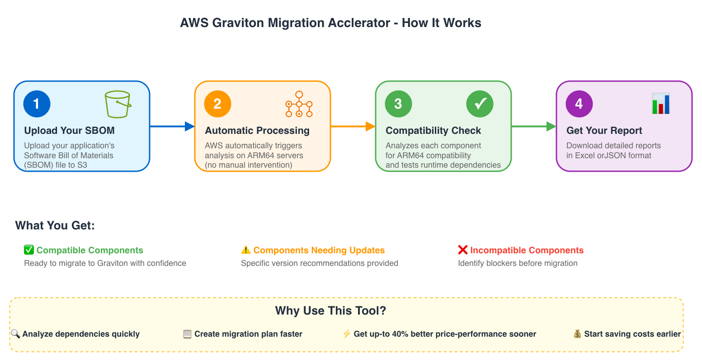

# Migration Accelerator for Graviton

**Automatically analyze SBOM files and dependency manifests for Java, Node.js, Python, .NET, and Ruby applications to determine AWS Graviton (ARM64) compatibility and accelerate your migration to Graviton instances.**

## Overview

Migrating from x86 to AWS Graviton [ARM64] offers known benefits such as up to 40% better price-performance, up to 20% less expensive, up to 60% less energy consumption in comparison to x86 based servers. AWS Graviton makes an ideal choice for cloud native workloads seeking both economic and environmental benefits.

The migration to AWS Graviton processors follows a structured three-phase approach: Assess, Mobilize, and Migrate & Optimize. Assessment for AWS Graviton migration needs to occur at multiple levels:

- Operating system compatibility
- ISV software compatibility
- Application library dependency compatibility

One of the key challenges during the Assessment phase is discovering and analyzing application compatibility with AWS Graviton. This is currently done manually, which is a time-consuming and error-prone process. To streamline this process, we've developed the Migration Accelerator for Graviton tool. It helps in identifying the running application (processes) on a VM/instance, and along with the application dependency file (such as pom.xml, requirements.txt, package.json, etc), it also validates the dependency compatibility on an AWS Graviton instance. It can highlight the software components that are supported on AWS Graviton, those which need upgrades before migrating to AWS Graviton, and components that are not yet supported on AWS Graviton instances.

## Why Migrate to AWS Graviton?

- **💰 Up to 20% cost savings** compared to similar x86 instances
- **⚡ Up to 40% better price-performance** for most workloads
- **🌱 60% less energy consumption** for sustainable computing
- **🚀 Better performance** for cloud-native applications

## Target Audience

This solution is designed for:
- **Application architects** planning AWS Graviton migrations
- **DevOps engineers** managing containerized applications
- **Security teams** conducting dependency assessments
- **Development teams** modernizing applications for ARM architecture

## What Can It Analyze?

### 📋 Application Inventories (SBOM Files)
- CycloneDX, SPDX, and Syft formats
- Generated by any SBOM generation tool (AWS Inspector, Syft, Trivy, etc.)
- **Don't have SBOM files yet?** Use [AWS Inspector SBOM generator](https://aws.amazon.com/inspector/) or our [app_identifier scripts](../app_identifier/) to generate them from running systems

### 📦 Dependency Files
- **Java**: `pom.xml`, JAR/WAR/EAR files
- **Python**: `requirements.txt`
- **Node.js**: `package.json`
- **.NET**: `.csproj`, `packages.config`
- **Ruby**: `Gemfile`, `.gemspec`

## How Does It Work?



### 🔍 **Analysis Process**
1. **Upload** your SBOM file or dependency manifest
2. **Automatic Analysis** checks each component for Graviton compatibility
3. **Runtime Testing** (optional) actually tests package installation on ARM64
4. **Get Results** in Excel, JSON, or Markdown format

### 📊 **Compatibility Results**
| Status | Meaning | What to do |
|--------|---------|------------|
| ✅ **Compatible** | Ready for AWS Graviton | Migrate with confidence |
| ⚠️ **Needs Upgrade** | Newer version supports ARM64 | Update to recommended version |
| ❌ **Incompatible** | No ARM64 support | Find alternatives or contact vendor |
| 🔍 **Needs Testing** | Requires verification | Test on AWS Graviton before migration |
| ❓ **Unknown** | No data available | Research and test manually |

## Architecture

### Solution Overview

This solution uses AWS Batch with ECS on Graviton3 EC2 instances to provide event-driven, serverless SBOM analysis. The architecture follows AWS Well-Architected Framework principles for security, reliability, and cost optimization.


For detailed architecture information, see [Architecture Documentation](docs/ARCHITECTURE_AND_WORKFLOWS.md).

### AWS Services Used

| Service | Purpose |
|---------|---------|
| **Amazon S3** | SBOM file storage and results collection |
| **Amazon EventBridge** | Event-driven trigger on S3 uploads |
| **AWS Lambda** | Batch job submission orchestration |
| **AWS Batch** | Managed job scheduling and execution |
| **Amazon ECS** | Container orchestration on EC2 |
| **Amazon EC2 (Graviton3)** | ARM64 compute for accurate testing |
| **Amazon CloudWatch** | Monitoring, logging, and dashboards |

## Getting Started

### Prerequisites

- AWS account with administrative permissions
- AWS CLI version 2.0 or later configured with appropriate credentials
- Python 3.8+ (for local analysis)
- Terraform v1.0+ (for infrastructure deployment)
- Docker (for local analysis with `--containers` flag)

### Option 0: Generate SBOM Files (If Needed)

**If you don't have SBOM files, you can generate them using:**

1. **Existing SBOM Tools**: Any tool that exports CycloneDX format SBOM files can be used
2. **[app_identifier scripts](../app_identifier/)**: Generate SBOM from running instances/VMs
3. **[AWS Inspector SBOM Generator](https://aws.amazon.com/inspector/)**: Generate SBOM by scanning source code, Dockerfiles, or container images

```bash
# Option 1: Use app_identifier for running instances/VMs
cd ../app_identifier
./app_identifier.sh

# Fleet-wide discovery using AWS SSM
./execute-fleet-discovery.sh execute --all

# Or use Ansible for multiple servers
ansible-playbook -i inventory.ini graviton-discovery-ansible.yml
```

This generates CycloneDX SBOM files that you can then analyze with the compatibility validator.

### Option 1: AWS Hosted Solution (Recommended)

**Fully managed analysis with event-driven AWS Batch processing**

#### Step 1: Deploy Infrastructure

```bash
# Deploy everything with one command
./deploy.sh

# The deploy script automatically:
# - Deploys Terraform infrastructure
# - Enables S3 EventBridge notifications
# - Verifies deployment
# - Shows usage instructions

# Or manual deployment
cd terraform
terraform init && terraform apply

# Enable S3 EventBridge notifications (required for triggering)
BUCKET=$(terraform output -raw s3_bucket_name)
aws s3api put-bucket-notification-configuration \
  --bucket $BUCKET \
  --notification-configuration '{"EventBridgeConfiguration": {}}'
```

#### Step 2: Upload SBOM Files

```bash
# Get your S3 bucket name
BUCKET_NAME=$(cd terraform && terraform output -raw s3_bucket_name)

# Individual mode: Upload SBOM files to trigger analysis
aws s3 cp my-app-sbom.json s3://$BUCKET_NAME/input/individual/

# Batch mode: Upload multiple SBOMs and manifest file
aws s3 sync ./my-sbom-files/ s3://$BUCKET_NAME/input/batch/my-project/
cat > batch-manifest.txt <<EOF
app1.sbom.json
app2.sbom.json
app3.sbom.json
EOF
aws s3 cp batch-manifest.txt s3://$BUCKET_NAME/input/batch/my-project/
```

#### Step 3: Monitor and Download Results

```bash
# Monitor Batch job execution
QUEUE=$(cd terraform && terraform output -raw batch_job_queue_name)
aws batch list-jobs --job-queue $QUEUE --job-status RUNNING

# View logs
aws logs tail /aws/batch/graviton-validator --follow

# View monitoring dashboard
echo "Dashboard: $(cd terraform && terraform output -raw dashboard_url)"

# List available results
aws s3 ls s3://$BUCKET_NAME/output/individual/ --recursive

# Download all reports for a specific SBOM
aws s3 sync s3://$BUCKET_NAME/output/individual/<sbom-name>/ ./results/

# Download batch project results
aws s3 sync s3://$BUCKET_NAME/output/batch/my-project/ ./results/
```

### Option 2: Local Analysis

**Run analysis directly on your machine**

#### Step 1: Install Requirements

```bash
# Clone repository
git clone https://github.com/awslabs/migration-accelerator-graviton
cd migration-accelerator-graviton

# Install Python dependencies
pip install -r requirements.txt
```

#### Step 2: Run Analysis

```bash
# Basic analysis (knowledge base only)
python graviton_validator.py examples/sample_sbom.json

# With runtime testing (recommended - requires Docker)
python graviton_validator.py my-app-sbom.json --runtime --test --containers

# Generate Excel report
python graviton_validator.py my-app-sbom.json --runtime --test --containers -f excel -o report.xlsx

# Batch analysis
python graviton_validator.py -d ./sbom-files/ --runtime --test --containers -f excel
```

**Note:** The `--containers` flag requires Docker to be installed and running.

**⚠️ Important:** For most accurate runtime testing results, run the tool on an ARM64/Graviton instance. The AWS Batch infrastructure automatically uses Graviton3 instances for testing.

For detailed usage instructions, see [Quick Start Guide](docs/QUICK_START.md) and [CLI Reference](docs/CLI_REFERENCE.md).

## Advanced Features

### 🧪 Runtime Testing
- Actually installs packages to verify ARM64 compatibility
- Tests native code compilation and execution
- Supports containerized testing with Docker/Podman
- Provides confidence scores for migration decisions

### 📈 Multi-Stage Analysis
- SBOM-only mode for manifest generation
- Runtime-only mode for parallel execution
- Merge capabilities for consolidated reports
- Batch analysis across multiple applications

### ☁️ AWS Integration
- Event-driven processing: S3 → EventBridge → Lambda → AWS Batch
- Managed EC2 lifecycle with auto-scaling (0 to max instances)
- Built-in job queuing and retry logic (3 attempts)
- Spot instance support for up to 90% cost savings
- CloudWatch dashboard and monitoring

## Common Use Cases

### 🏢 Enterprise Migration Planning
```bash
# Analyze entire application portfolio
python graviton_validator.py -d ./all-sboms/ -f excel -o portfolio-analysis.xlsx
```

### 🔄 CI/CD Integration
```bash
# Quick compatibility check in pipeline
python graviton_validator.py app-sbom.json --runtime --test --containers
```

### 📋 Detailed Assessment
```bash
# Comprehensive analysis with all features
python graviton_validator.py app-sbom.json --runtime --test --containers --jars ./libs/ -f excel
```

### 🚀 Multi-Stage Processing
```bash
# Stage 1: Generate manifests
python graviton_validator.py --sbom-only -d ./sboms

# Stage 2: Runtime analysis (can run in parallel)
python graviton_validator.py --runtime-only nodejs --test --containers
python graviton_validator.py --runtime-only python --test --containers

# Stage 3: Merge results
python graviton_validator.py --merge-runtime ./output_files/ -f excel
```

### 📁 Direct Manifest Analysis
```bash
# Analyze specific manifest files directly
python graviton_validator.py --runtime-only nodejs --test --containers --input-file package.json
python graviton_validator.py --runtime-only python --test --containers --input-file requirements.txt

# Merge multiple analysis results
python graviton_validator.py --merge ./results/*_analysis.json -f excel -o combined_report.xlsx
```

## Documentation

### 📖 User Guides
- **[Quick Start Guide](docs/QUICK_START.md)** - Get started in 5 minutes
- **[CLI Reference](docs/CLI_REFERENCE.md)** - Complete command-line reference
- **[JAR Enhancement Guide](docs/JAR_ENHANCEMENT_GUIDE.md)** - Java JAR/WAR/EAR analysis
- **[Troubleshooting](docs/TROUBLESHOOTING.md)** - Common issues and solutions

### 🔧 Technical Documentation
- **[Architecture and Workflows](docs/ARCHITECTURE_AND_WORKFLOWS.md)** - System architecture and execution modes
- **[Knowledge Base Guide](docs/KNOWLEDGE_BASE_GUIDE.md)** - Creating custom knowledge bases
- **[Class Documentation](docs/CLASS_DOCUMENTATION.md)** - API reference

### 🔄 Helper Scripts
- **[Scripts README](scripts/README.md)** - Knowledge base update scripts

## Sample Results

```
Graviton Compatibility Analysis Report
=====================================

📊 Summary:
  Total Components: 150
  ✅ Compatible: 120 (80.0%)
  ⚠️ Needs Upgrade: 20 (13.3%)
  ❌ Incompatible: 5 (3.3%)
  🔍 Needs Testing: 3 (2.0%)
  ❓ Unknown: 2 (1.3%)

🎯 Migration Readiness: 80% - Good for AWS Graviton migration

⚠️ Action Required:
  • numpy 1.19.0 → Upgrade to 1.21.0+ for ARM64 support
  • tensorflow 2.4.0 → No ARM64 wheels available, consider alternatives
  • bcrypt 3.2.0 → Native code requires ARM64 testing

💡 Recommendations:
  • 120 components are ready to migrate
  • Update 20 components to newer versions
  • Find alternatives for 5 incompatible components
```

## Security Considerations

### Data Protection

- **Encryption at rest**: All S3 objects encrypted with AWS-managed keys
- **Encryption in transit**: TLS 1.2+ for all data transfers
- **Access logging**: CloudTrail and CloudWatch for audit compliance

### Access Control

- **IAM roles**: Service-specific roles with least privilege permissions
- **Resource policies**: S3 bucket policies restrict access to authorized services
- **Job isolation**: Each Batch job runs in isolated container environment (when using `--containers` flag for runtime testing)

## Troubleshooting

### Common Issues

**AWS Batch job fails**:
- Check CloudWatch logs: `/aws/batch/graviton-validator`
- Verify S3 bucket permissions
- Ensure tool package is uploaded to S3

**Local analysis fails**:
- Install missing dependencies: `pip install -r requirements.txt`
- For `--containers` mode, ensure Docker is running
- Enable debug logging: `--debug -v --log-file analysis.log`

For detailed troubleshooting, see [Troubleshooting Guide](docs/TROUBLESHOOTING.md).

### Getting Support

For technical support:
1. Review AWS Inspector SBOM Generator documentation
2. Check AWS Graviton migration best practices
3. Consult AWS Support for account-specific issues

## Additional Resources

### AWS Documentation

- [AWS Graviton Technical Guide](https://github.com/aws/aws-graviton-getting-started)
- [AWS Batch User Guide](https://docs.aws.amazon.com/batch/)
- [AWS Well-Architected Framework](https://aws.amazon.com/architecture/well-architected/)

### Related Tools

- [App Identifier](../app_identifier/) - Generate SBOM files from running systems
- [AWS Inspector](https://aws.amazon.com/inspector/) - SBOM generation for EC2 instances, container images, and Dockerfiles
- [Syft](https://github.com/anchore/syft) - SBOM generation tool

### Community Resources

- [AWS Graviton Slack Community](https://aws-graviton.slack.com/)
- [CycloneDX Community](https://cyclonedx.org/community/)
- [SPDX Working Group](https://spdx.dev/participate/)

## Contributing

We welcome contributions to improve this solution. See [CONTRIBUTING.md](CONTRIBUTING.md) for detailed guidelines.

**Quick start:**

1. **Fork the repository** and create a feature branch
2. **Follow coding standards** for Python and Terraform
3. **Add tests** for new functionality
4. **Update documentation** for any changes
5. **Submit a pull request** with detailed description

### Development Guidelines

- Use Terraform best practices for infrastructure as code
- Follow AWS security best practices
- Include error handling in Python code
- Maintain backward compatibility when possible
- Document all configuration options

## License

This project is licensed under the MIT License. See the [LICENSE](LICENSE) file for complete details.

---

**Note**: This solution is provided as-is for educational and demonstration purposes. Always review and test thoroughly before using in production environments.
