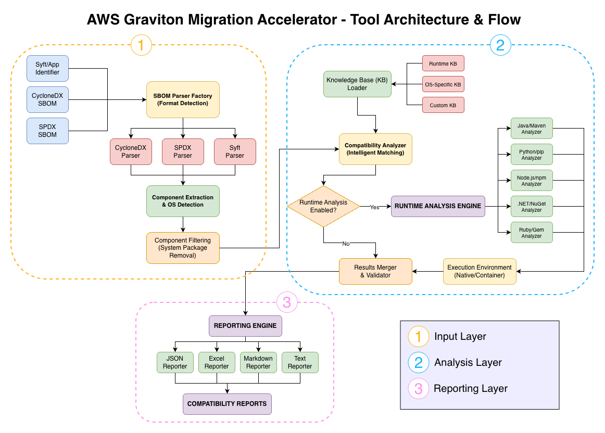

# Architecture and Workflows

Complete technical documentation of the Migration Accelerator for Graviton architecture, execution modes, and workflows.

## Table of Contents
1. [Tool Overview](#tool-overview)
2. [Architecture](#architecture)
3. [Execution Modes](#execution-modes)
4. [Analysis Pipeline](#analysis-pipeline)
5. [AWS Deployment](#aws-deployment)
6. [Performance Considerations](#performance-considerations)

---

## Tool Overview

### Purpose
Multi-stage SBOM compatibility analyzer for AWS Graviton (ARM64) migration assessment.

### Capabilities
- **SBOM Parsing**: CycloneDX, SPDX, Syft formats
- **Static Analysis**: Knowledge base matching with intelligent aliases
- **Runtime Testing**: Actual package installation verification
- **Multi-Runtime**: Python, Node.js, Java, .NET, Ruby
- **Multi-Stage**: Parallel processing for large portfolios
- **AWS Integration**: Event-driven Batch processing

---

## Architecture

### Tool Architecture & Flow



The diagram above shows the internal architecture with three main layers:
1. **Input Layer**: SBOM parsing and component extraction
2. **Analysis Layer**: Knowledge base matching and runtime testing
3. **Reporting Layer**: Multi-format report generation

### Core Modules

**Input Processing**:
- `parsers/` - SBOM format detection and parsing
- `models.py` - Data structures (SoftwareComponent, CompatibilityResult)

**Analysis Engine**:
- `analysis/compatibility_analyzer.py` - Main analysis logic
- `knowledge_base/` - KB loading and matching (SBOM analysis)
- `knowledge_base/runtime_loader.py` - Runtime KB fast-path (10-15 common packages per runtime)
- `filtering/` - System package detection

**Runtime Testing**:
- `analysis/python_runtime_analyzer.py` - Python: Runtime KB → PyPI API → Cache
- `analysis/nodejs_runtime_analyzer.py` - Node.js: Runtime KB → NPM API → Cache
- `analysis/java_runtime_analyzer.py` - Java: Runtime KB → Maven API → Cache
- `analysis/dotnet_runtime_analyzer.py` - .NET: Runtime KB → NuGet API → Cache
- `analysis/ruby_runtime_analyzer.py` - Ruby: Runtime KB → RubyGems API → Cache
- `analysis/cache_manager.py` - API response caching (.cache/ directory)

**Output Generation**:
- `reporting/` - Text, JSON, Excel, Markdown reporters

---

## Execution Modes

### Mode 1: Standard Analysis (Default)
```bash
python graviton_validator.py sbom.json
```

**What it does**:
- Parses SBOM file
- Matches components against knowledge base
- Checks deny lists
- Generates compatibility report

**Does NOT**:
- Install any packages
- Check package registries
- Require network access

**Use case**: Quick compatibility check, CI/CD pipelines

---

### Mode 2: Runtime Analysis
```bash
python graviton_validator.py sbom.json --runtime
```

**What it does**:
- Standard analysis PLUS
- Extracts dependency manifests from SBOM
- Queries package registries (PyPI, NPM, Maven, NuGet, RubyGems)
- Checks for ARM64-specific packages
- **Does NOT install packages** (read-only checks)

**Requires**: Network access

**Use case**: Verify package availability before migration

---

### Mode 3: Runtime Testing
```bash
python graviton_validator.py sbom.json --runtime --test
```

**What it does**:
- Runtime analysis PLUS
- **Actually installs packages** locally
- Tests import/require functionality
- Detects native code compilation issues

**⚠️ WARNING**: Modifies local environment

**Use case**: Full verification (use with --containers)

---

### Mode 4: Containerized Testing (Recommended)
```bash
python graviton_validator.py sbom.json --runtime --test --containers
```

**What it does**:
- Runtime testing in isolated Docker containers
- Automatic cleanup
- Safe for production environments

**Requires**: Docker or Podman

**Use case**: Production-safe comprehensive testing

---

### Mode 5: SBOM-Only (Multi-Stage Build)
```bash
python graviton_validator.py --sbom-only -d ./sboms/
```

**What it does**:
- Parses SBOMs
- Extracts dependency manifests
- Saves to `output_files/` directory
- No compatibility analysis
- No runtime testing

**Output**: Manifests for each runtime
- `<name>_requirements.txt` (Python)
- `<name>_package.json` (Node.js)
- `<name>_pom.xml` (Java)
- `<name>_test.csproj` (.NET)
- `<name>_Gemfile` (Ruby)

**Use case**: Stage 1 of parallel runtime testing

---

### Mode 6: Runtime-Only (Multi-Stage Build)
```bash
python graviton_validator.py --runtime-only auto --test --containers
```

**What it does**:
- Reads manifests from `output_files/`
- Tests each runtime independently
- No SBOM parsing

**Supports**: `auto`, `python`, `nodejs`, `java`, `dotnet`, `ruby`

**Use case**: Stage 2 of parallel runtime testing (can run on different machines)

---

### Mode 7: Direct Manifest Analysis
```bash
python graviton_validator.py --runtime-only python --input-file requirements.txt --test --containers
```

**What it does**:
- Analyzes specific manifest file directly
- No SBOM required

**Use case**: Test individual dependency files

---

### Mode 8: Merge Reports
```bash
python graviton_validator.py --merge report1.json report2.json -f excel
```

**What it does**:
- Combines multiple JSON analysis reports
- Deduplicates components
- Generates unified report

**Use case**: Portfolio-level reporting

---

### Mode 9: Merge Runtime Results
```bash
python graviton_validator.py --merge-runtime ./output_files/ -f excel
```

**What it does**:
- Merges SBOM analysis with runtime results
- Automatically finds matching files
- Combines compatibility data

**Use case**: Stage 3 of multi-stage builds

---

## Analysis Pipeline

### Step 1: Input Validation
```
Check file existence → Validate SBOM format → Verify configuration
```

### Step 2: Configuration Loading
```
Load default config → Apply custom config → Override with CLI args
```

### Step 3: SBOM Parsing
```
Detect format → Parse components → Extract metadata → Identify system packages
```

### Step 4: Component Analysis
```
Normalize names → Check deny lists → Match knowledge base → Apply version ranges
```

### Step 5: Runtime Analysis (Optional)
```
Extract manifests → Query registries → Test installation → Detect native code
```

### Step 6: Report Generation
```
Aggregate results → Calculate statistics → Generate output format
```

---

## AWS Deployment

### Architecture

```
S3 Upload → EventBridge → Lambda → AWS Batch → EC2 (Graviton3) → S3 Results
```

### Components

**S3 Bucket**:
- Input: `s3://bucket/input/individual/` or `s3://bucket/input/batch/`
- Output: `s3://bucket/output/individual/` or `s3://bucket/output/batch/`

**EventBridge**:
- Triggers on S3 object creation
- Routes to Lambda function

**Lambda Function**:
- Validates input
- Submits Batch job
- Passes S3 paths as parameters

**AWS Batch**:
- Job Queue: Manages job scheduling
- Compute Environment: Graviton3 EC2 instances (c7g.xlarge)
- Job Definition: Container with validator tool

**EC2 Instances**:
- ARM64 architecture (Graviton3)
- Auto-scaling (0 to max instances)
- Spot instance support (optional)

### Deployment

```bash
# Deploy infrastructure
./deploy.sh

# Automatically handles:
# - Terraform deployment
# - EventBridge configuration
# - Verification
```

### Usage Modes

**Individual Mode**: One SBOM per job
```bash
aws s3 cp app.sbom.json s3://bucket/input/individual/
```

**Batch Mode**: Multiple SBOMs per job
```bash
aws s3 sync ./sboms/ s3://bucket/input/batch/project/
aws s3 cp batch-manifest.txt s3://bucket/input/batch/project/
```

### Monitoring

**CloudWatch Dashboard**: Real-time metrics
- Active jobs count
- Job success/failure rates
- Latest job logs

**Logs**: `/aws/batch/graviton-validator`

---

## Performance Considerations

### Fast Mode (No Runtime)
- **Speed**: 1000+ components in seconds
- **Memory**: Minimal
- **Network**: Not required
- **Use case**: CI/CD, quick checks

### Runtime Analysis Mode
- **Speed**: +10-30 seconds per runtime
- **Memory**: Moderate
- **Network**: Required (package registries)
- **Use case**: Verify availability

### Runtime Testing Mode
- **Speed**: +1-5 minutes per runtime
- **Memory**: High (package installation)
- **Disk**: Significant (packages stored)
- **Use case**: Full verification

### Containerized Testing Mode
- **Speed**: +2-10 minutes per runtime
- **Memory**: High (Docker overhead)
- **Disk**: Significant (container images)
- **Use case**: Production-safe testing

### Multi-Stage Build Workflow

**Optimal for large portfolios**:

```bash
# Stage 1: Generate manifests (fast, parallel)
python graviton_validator.py --sbom-only -d ./sboms/

# Stage 2: Test runtimes (parallel on different machines)
python graviton_validator.py --runtime-only python --test --containers &
python graviton_validator.py --runtime-only nodejs --test --containers &
python graviton_validator.py --runtime-only java --test --containers &

# Stage 3: Merge results
python graviton_validator.py --merge-runtime -f excel
```

**Benefits**:
- Parallel execution
- Faster overall time
- Can run on different architectures
- Optimal resource utilization

---

## Best Practices

### 1. Always Use Containers with Testing
```bash
# Good
python graviton_validator.py sbom.json --runtime --test --containers

# Risky
python graviton_validator.py sbom.json --runtime --test
```

### 2. Use Multi-Stage for Large Portfolios
```bash
# For 100+ applications
--sbom-only → parallel --runtime-only → --merge-runtime
```

### 3. Enable Verbose Logging for Troubleshooting
```bash
python graviton_validator.py sbom.json --runtime --test --containers -v --log-file debug.log
```

### 4. Use Custom Knowledge Bases
```bash
python graviton_validator.py sbom.json -k company-kb.json -k team-kb.json
```

### 5. Keep Temp Files for Debugging
```bash
python graviton_validator.py sbom.json --runtime --test --no-cleanup
```

---

## Knowledge Base Maintenance

The tool uses static knowledge base files in the `knowledge_bases/` directory for compatibility analysis. These databases can be updated using helper scripts.

### Available Update Scripts

**OS Package Databases** (`scripts/generate_all_os_kb.sh`, `scripts/generate_docker_kb.sh`):
- Generates ARM64-compatible package lists for various Linux distributions
- Uses Docker containers to simulate each OS environment
- Supports Amazon Linux, Ubuntu, CentOS, Debian, Alpine

**ISV Software Database** (`scripts/isv_scraper.py`):
- Scrapes ISV compatibility data from AWS Graviton Getting Started Guide
- Updates `knowledge_bases/isv_graviton_packages.json`

**ARM Ecosystem Database** (`scripts/arm_ecosystem_scraper.py`):
- Scrapes compatibility data from Arm Developer Hub Ecosystem Dashboard
- Provides broader software ecosystem compatibility information

### Updating Knowledge Bases

```bash
# Update OS package databases
cd scripts
./generate_all_os_kb.sh

# Update ISV database
python isv_scraper.py

# Update ARM ecosystem database
python arm_ecosystem_scraper.py
```

For detailed information about these scripts and their usage, see [scripts/README.md](../scripts/README.md).

---

## See Also

- [CLI Reference](CLI_REFERENCE.md) - Complete command-line options
- [Quick Start](QUICK_START.md) - Getting started guide
- [Class Documentation](CLASS_DOCUMENTATION.md) - API reference
- [Knowledge Base Guide](KNOWLEDGE_BASE_GUIDE.md) - Creating and maintaining knowledge bases
