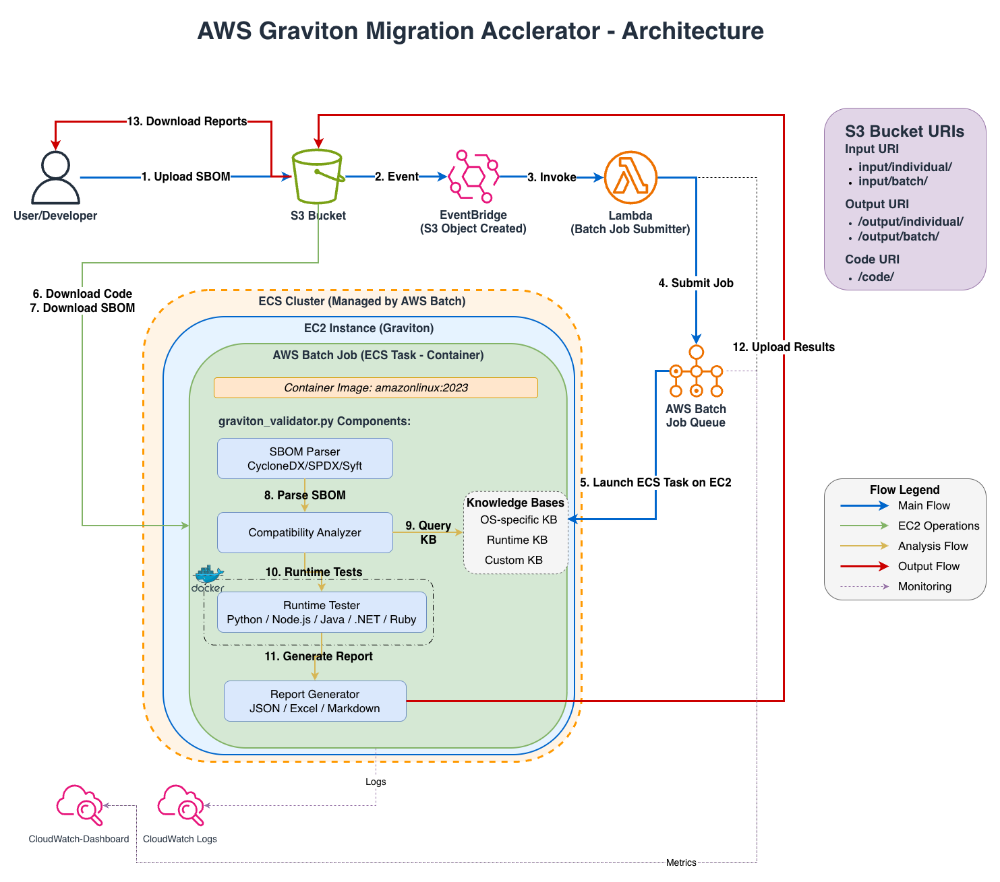

# Migration Accelerator for Graviton - Deployed Architecture

**Account:** prushok+graviton-Admin  
**Region:** us-east-1  
**Deployment ID:** vjqx4x  
**Last Updated:** December 2, 2025

## Architecture Overview

This document describes the actual deployed infrastructure for the Migration Accelerator for Graviton solution in your AWS account.



### Deployed Resources

```
┌─────────────────────────────────────────────────────────────────────────────┐
│                         AWS Account: prushok+graviton-Admin                  │
│                              Region: us-east-1                               │
└─────────────────────────────────────────────────────────────────────────────┘
                                      │
                                      ▼

┌──────────────────────────────────────────────────────────────────────────────┐
│                    S3 Bucket: graviton-validator-vjqx4x                      │
│                    Encryption: KMS (7f2aaf6f-e885...)                        │
│                    Versioning: Enabled | Lifecycle: 90 days                  │
├──────────────────────────────────────────────────────────────────────────────┤
│  📁 input/                                                                   │
│     ├── individual/  ← Upload single SBOM files (.json)                     │
│     └── batch/       ← Upload batch-manifest.txt + multiple SBOMs           │
│  📁 output/                                                                  │
│     ├── individual/  ← Analysis results per SBOM                            │
│     └── batch/       ← Consolidated batch analysis results                  │
│  📁 code/                                                                    │
│     └── migration-accelerator-graviton.zip ← Validator tool package         │
└──────────────────────────────────────────────────────────────────────────────┘
                                      │
                                      │ S3 Event Notification
                                      │ (EventBridge enabled)
                                      ▼

┌──────────────────────────────────────────────────────────────────────────────┐
│                          Amazon EventBridge Rules                            │
├──────────────────────────────────────────────────────────────────────────────┤
│  📋 graviton-validator-individual-vjqx4x                                     │
│     Pattern: input/individual/*.json                                         │
│     Trigger: On S3 Object Created                                            │
│                                                                              │
│  📋 graviton-validator-batch-vjqx4x                                          │
│     Pattern: **/batch-manifest.txt                                           │
│     Trigger: On S3 Object Created                                            │
└──────────────────────────────────────────────────────────────────────────────┘
                                      │
                                      │ Invoke Lambda
                                      ▼

┌──────────────────────────────────────────────────────────────────────────────┐
│         Lambda Function: graviton-validator-batch-trigger-vjqx4x             │
│         Runtime: Python 3.11 | Timeout: 60s | Memory: 128MB                  │
│         VPC: vpc-032193697daff2f33 (Private Subnets)                         │
├──────────────────────────────────────────────────────────────────────────────┤
│  Features:                                                                   │
│  ✓ X-Ray Tracing: Active                                                    │
│  ✓ Code Signing: Enabled (AWS Signer)                                       │
│  ✓ Dead Letter Queue: graviton-validator-lambda-dlq-vjqx4x                  │
│  ✓ Reserved Concurrency: 50                                                 │
│  ✓ KMS Encryption: Environment variables encrypted                          │
│                                                                              │
│  Responsibilities:                                                           │
│  1. Parse S3 event to determine mode (individual/batch)                     │
│  2. Extract SBOM metadata and project information                           │
│  3. Check for duplicate running jobs (idempotent)                           │
│  4. Submit AWS Batch job with appropriate parameters                        │
└──────────────────────────────────────────────────────────────────────────────┘
                                      │
                                      │ Submit Job
                                      ▼

┌──────────────────────────────────────────────────────────────────────────────┐
│                    AWS Batch Job Queue: graviton-validator-queue-vjqx4x      │
│                    Priority: 1 | State: ENABLED                              │
└──────────────────────────────────────────────────────────────────────────────┘
                                      │
                                      ▼
┌──────────────────────────────────────────────────────────────────────────────┐
│              Compute Environment: graviton-validator-vjqx4x                  │
│              Type: MANAGED | State: ENABLED                                  │
├──────────────────────────────────────────────────────────────────────────────┤
│  Instance Configuration:                                                     │
│  • Type: m7g.xlarge (Graviton3 - 4 vCPUs, 16GB RAM)                         │
│  • Min vCPUs: 0 (scales to zero when idle)                                  │
│  • Max vCPUs: 20 (max 5 concurrent jobs)                                    │
│  • Desired vCPUs: 0 (auto-scaling)                                          │
│  • Allocation: BEST_FIT_PROGRESSIVE                                          │
│                                                                              │
│  Network:                                                                    │
│  • VPC: vpc-032193697daff2f33                                               │
│  • Subnets: subnet-018c59810833d5bf7 (10.0.10.0/24, us-east-1a)            │
│             subnet-0b6c052e7040738cf (10.0.11.0/24, us-east-1b)            │
│  • Security Group: graviton-validator-batch-ec2-sg                          │
│    - Egress: HTTPS (443), HTTP (80), Ephemeral (1024-65535)                │
│    - Ingress: None (no inbound access needed)                               │
└──────────────────────────────────────────────────────────────────────────────┘
                                      │
                                      ▼

┌──────────────────────────────────────────────────────────────────────────────┐
│              Job Definition: graviton-validator-job-vjqx4x                   │
│              Platform: EC2 | Container: Amazon Linux 2023                    │
├──────────────────────────────────────────────────────────────────────────────┤
│  Container Configuration:                                                    │
│  • Image: public.ecr.aws/amazonlinux/amazonlinux:2023                       │
│  • vCPUs: 3 per job                                                          │
│  • Memory: 15360 MB (15 GB) per job                                          │
│  • Privileged: true (required for Docker-in-Docker)                         │
│  • Job Role: graviton-validator-batch-job-vjqx4x                            │
│                                                                              │
│  Execution Flow:                                                             │
│  1. Install dependencies (Python 3.11, Docker, AWS CLI, jq)                 │
│  2. Start Docker daemon (for container-based runtime analysis)              │
│  3. Retrieve IAM credentials from EC2 instance metadata (IMDSv2)            │
│  4. Download validator tool from S3 (code/migration-accelerator-graviton.zip)│
│  5. Download SBOM file(s) from S3                                           │
│  6. Run graviton_validator.py with --runtime --test --containers flags      │
│  7. Upload results (Excel, JSON, Markdown) to S3 output/ folder             │
│                                                                              │
│  Logging:                                                                    │
│  • CloudWatch Log Group: /aws/batch/graviton-validator                      │
│  • Stream Prefix: job/                                                      │
│  • Retention: 365 days                                                      │
│  • KMS Encrypted: Yes                                                       │
└──────────────────────────────────────────────────────────────────────────────┘


## Network Architecture

```
┌─────────────────────────────────────────────────────────────────────────────┐
│                    VPC: vpc-032193697daff2f33 (10.0.0.0/16)                 │
├─────────────────────────────────────────────────────────────────────────────┤
│                                                                             │
│  ┌────────────────────────────┐    ┌────────────────────────────┐         │
│  │  Availability Zone A       │    │  Availability Zone B       │         │
│  │  (us-east-1a)              │    │  (us-east-1b)              │         │
│  ├────────────────────────────┤    ├────────────────────────────┤         │
│  │                            │    │                            │         │
│  │  Public Subnet             │    │  Public Subnet             │         │
│  │  subnet-03e5629aa9510cf18  │    │  subnet-0f5044b4e7bf447f8  │         │
│  │  10.0.1.0/24               │    │  10.0.2.0/24               │         │
│  │  ┌──────────────────┐      │    │                            │         │
│  │  │  NAT Gateway     │      │    │                            │         │
│  │  │  (Single)        │      │    │                            │         │
│  │  └──────────────────┘      │    │                            │         │
│  │          │                 │    │                            │         │
│  └──────────┼─────────────────┘    └────────────────────────────┘         │
│             │                                                              │
│  ┌──────────┼─────────────────┐    ┌────────────────────────────┐         │
│  │          ▼                 │    │                            │         │
│  │  Private Subnet            │    │  Private Subnet            │         │
│  │  subnet-018c59810833d5bf7  │    │  subnet-0b6c052e7040738cf  │         │
│  │  10.0.10.0/24              │    │  10.0.11.0/24              │         │
│  │  ┌──────────────────┐      │    │  ┌──────────────────┐      │         │
│  │  │  Lambda Function │      │    │  │  Batch EC2       │      │         │
│  │  │  (VPC-attached)  │      │    │  │  Instances       │      │         │
│  │  └──────────────────┘      │    │  └──────────────────┘      │         │
│  │                            │    │                            │         │
│  └────────────────────────────┘    └────────────────────────────┘         │
│                                                                             │
└─────────────────────────────────────────────────────────────────────────────┘
                                      │
                                      │ Internet Gateway
                                      ▼
                                  Internet
```

### Network Flow:
1. **Lambda Function** (Private Subnet) → NAT Gateway → Internet Gateway → AWS APIs
2. **Batch EC2 Instances** (Private Subnet) → NAT Gateway → Internet Gateway → Package Registries
3. **No Direct Internet Access** to private resources (security best practice)


## Security Architecture

### Encryption at Rest
```
┌─────────────────────────────────────────────────────────────────────────────┐
│                         KMS Keys (Customer Managed)                          │
├─────────────────────────────────────────────────────────────────────────────┤
│                                                                             │
│  🔐 S3 Encryption Key                                                       │
│     Alias: alias/graviton-validator-s3-vjqx4x                               │
│     Key ID: 7f2aaf6f-e885-4a16-96e8-b1de6a182e3d                            │
│     Rotation: Enabled (Annual)                                              │
│     Usage:                                                                  │
│     • S3 bucket encryption (graviton-validator-vjqx4x)                      │
│     • CloudWatch Logs encryption                                            │
│     • Lambda environment variables encryption                               │
│     • SQS Dead Letter Queue encryption                                      │
│                                                                             │
│  🔐 EBS Encryption Key                                                      │
│     Alias: alias/graviton-validator-ebs-vjqx4x                              │
│     Key ID: 9168639c-42a0-4b1b-ae90-9a0fed7c7ada                            │
│     Rotation: Enabled (Annual)                                              │
│     Usage:                                                                  │
│     • Batch EC2 instance EBS volumes                                        │
│                                                                             │
└─────────────────────────────────────────────────────────────────────────────┘
```

### IAM Roles and Permissions

#### 1. Lambda Execution Role
**Role:** `graviton-validator-lambda-vjqx4x`
- **Permissions:**
  - Submit AWS Batch jobs
  - List and describe Batch jobs (idempotency check)
  - Write to CloudWatch Logs
  - Send messages to DLQ (SQS)
  - X-Ray tracing
  - KMS decrypt/encrypt
  - VPC network interface management

#### 2. Batch Service Role
**Role:** `graviton-validator-batch-service-vjqx4x`
- **Permissions:**
  - Managed policy: `AWSBatchServiceRole`
  - Manage compute environments
  - Launch and terminate EC2 instances
  - Create and manage ECS tasks

#### 3. Batch Job Role (Container)
**Role:** `graviton-validator-batch-job-vjqx4x`
- **Permissions:**
  - Read/Write S3 bucket (graviton-validator-vjqx4x)
  - KMS decrypt/encrypt for S3 operations
  - Write to CloudWatch Logs

#### 4. Batch EC2 Instance Role
**Role:** `graviton-validator-batch-ec2-vjqx4x`
- **Permissions:**
  - Managed policy: `AmazonEC2ContainerServiceforEC2Role`
  - Read/Write S3 bucket (needed for privileged containers)
  - KMS decrypt/encrypt
  - ECS agent communication


## Data Flow - Complete 14-Step Process

### Individual Mode (Single SBOM Analysis)

```
Step 1: Developer uploads SBOM
        ↓
        aws s3 cp app.sbom.json s3://graviton-validator-vjqx4x/input/individual/
        ↓
Step 2: S3 generates Object Created event
        ↓
Step 3: EventBridge rule (graviton-validator-individual-vjqx4x) matches pattern
        ↓
Step 4: Lambda function invoked with S3 event details
        ↓
Step 5: Lambda parses event, extracts SBOM filename
        ↓
Step 6: Lambda checks for duplicate running jobs (idempotency)
        ↓
Step 7: Lambda submits Batch job with individual mode script
        ↓
Step 8: Batch job queue receives job submission
        ↓
Step 9: Compute environment provisions m7g.xlarge Graviton3 instance
        ↓
Step 10: Container starts on EC2 instance
         • Installs Python 3.11, Docker, AWS CLI
         • Starts Docker daemon
         • Retrieves IAM credentials from instance metadata
         ↓
Step 11: Downloads validator tool and SBOM from S3
         • s3://graviton-validator-vjqx4x/code/migration-accelerator-graviton.zip
         • s3://graviton-validator-vjqx4x/input/individual/app.sbom.json
         ↓
Step 12: Runs graviton_validator.py with runtime analysis
         • Parses SBOM (CycloneDX/SPDX)
         • Detects package managers (Maven, npm, pip, NuGet, Gem)
         • Builds Docker containers for each runtime
         • Installs packages on ARM64 architecture
         • Runs tests and compatibility checks
         • Generates compatibility report
         ↓
Step 13: Uploads results to S3
         • s3://graviton-validator-vjqx4x/output/individual/app/
         • Files: app.xlsx, app_merged_analysis.json, runtime logs
         ↓
Step 14: Job completes, logs written to CloudWatch
         • /aws/batch/graviton-validator/job/default/<job-id>
         • EC2 instance terminates (scales to zero)
```


### Batch Mode (Multiple SBOM Analysis)

```
Step 1: Developer uploads multiple SBOMs to project folder
        ↓
        aws s3 cp app1.sbom.json s3://graviton-validator-vjqx4x/input/batch/my-project/
        aws s3 cp app2.sbom.json s3://graviton-validator-vjqx4x/input/batch/my-project/
        aws s3 cp app3.sbom.json s3://graviton-validator-vjqx4x/input/batch/my-project/
        ↓
Step 2: Developer creates and uploads batch-manifest.txt
        ↓
        cat > batch-manifest.txt <<EOF
        app1.sbom.json
        app2.sbom.json
        app3.sbom.json
        EOF
        ↓
        aws s3 cp batch-manifest.txt s3://graviton-validator-vjqx4x/input/batch/my-project/
        ↓
Step 3: S3 generates Object Created event for batch-manifest.txt
        ↓
Step 4: EventBridge rule (graviton-validator-batch-vjqx4x) matches pattern
        ↓
Step 5: Lambda function invoked with manifest file event
        ↓
Step 6: Lambda parses event, extracts project directory path
        ↓
Step 7: Lambda checks for duplicate running jobs (idempotency)
        ↓
Step 8: Lambda submits Batch job with batch mode script
        ↓
Step 9: Batch job queue receives job submission
        ↓
Step 10: Compute environment provisions m7g.xlarge Graviton3 instance
         ↓
Step 11: Container starts and downloads manifest + all SBOMs
         • Downloads batch-manifest.txt
         • Parses manifest to get list of SBOM files
         • Downloads each SBOM file to ./sboms/ directory
         ↓
Step 12: Runs graviton_validator.py in directory mode
         • python3.11 graviton_validator.py -d ./sboms --runtime --test --containers
         • Processes all SBOMs in parallel
         • Generates consolidated report
         ↓
Step 13: Uploads consolidated results to S3
         • s3://graviton-validator-vjqx4x/output/batch/my-project/
         • Files: my-project-report.xlsx, merged analysis, individual runtime logs
         ↓
Step 14: Job completes, logs written to CloudWatch
         • EC2 instance terminates (scales to zero)
```


## Monitoring and Observability

### CloudWatch Dashboard
**Name:** `Graviton-Validator-vjqx4x`  
**URL:** https://us-east-1.console.aws.amazon.com/cloudwatch/home?region=us-east-1#dashboards:name=Graviton-Validator-vjqx4x

**Widgets:**
1. **Batch Job Status (5min intervals)**
   - Jobs Submitted
   - Jobs Running
   - Jobs Succeeded
   - Jobs Failed

2. **Active Jobs (Real-time)**
   - Running Jobs (current count)
   - Queued Jobs (waiting to start)

3. **Lambda Metrics**
   - Invocations
   - Errors
   - Duration (average)

4. **Latest Job Logs**
   - Last 50 log entries from Batch jobs
   - Real-time log streaming

### CloudWatch Alarms
**Alarm:** `graviton-validator-batch-failures-vjqx4x`
- **Metric:** JobsFailed
- **Threshold:** > 3 failures in 5 minutes
- **Action:** Alert (can be configured for SNS notifications)

### Log Groups
1. **Lambda Logs**
   - Group: `/aws/lambda/graviton-validator-batch-trigger-vjqx4x`
   - Retention: 365 days
   - KMS Encrypted: Yes

2. **Batch Job Logs**
   - Group: `/aws/batch/graviton-validator`
   - Retention: 365 days
   - KMS Encrypted: Yes
   - Stream Pattern: `job/default/<job-id>`

### X-Ray Tracing
- **Lambda Function:** Active tracing enabled
- **Service Map:** Shows Lambda → Batch → S3 interactions
- **Trace Analysis:** Available for debugging performance issues


## Cost Optimization Features

### Auto-Scaling
- **Min vCPUs:** 0 (scales to zero when idle - no cost)
- **Max vCPUs:** 20 (limits maximum concurrent jobs)
- **Desired vCPUs:** 0 (starts at zero, scales up on demand)
- **Scale-down:** Automatic after job completion

### Instance Selection
- **Current:** m7g.xlarge (On-Demand)
  - 4 vCPUs, 16 GB RAM
  - Graviton3 processor
  - Cost: ~$0.1632/hour

- **Spot Option Available:** Set `batch_use_spot = true`
  - Up to 90% cost savings
  - Multiple instance types for better availability
  - Fallback: m7g.xlarge, m7g.large, m6g.xlarge, m6g.large, c7g.xlarge

### S3 Lifecycle Policies
- **General Objects:** Deleted after 90 days
- **Access Logs:** Deleted after 30 days
- **Old Versions:** Deleted after 30 days
- **Incomplete Uploads:** Aborted after 7 days

### Resource Tagging
All resources tagged with:
- `Name`: Descriptive resource name
- `Environment`: production
- Enables cost allocation and tracking

## Disaster Recovery and High Availability

### Multi-AZ Deployment
- **Availability Zones:** us-east-1a, us-east-1b
- **Subnets:** Distributed across both AZs
- **Batch Compute:** Can launch instances in either AZ
- **Lambda:** Automatically deployed across multiple AZs

### Data Durability
- **S3:** 99.999999999% (11 9's) durability
- **Versioning:** Enabled (protects against accidental deletion)
- **Encryption:** KMS with automatic key rotation

### Backup and Recovery
- **S3 Versioning:** Previous versions retained for 30 days
- **CloudWatch Logs:** Retained for 365 days
- **Terraform State:** Infrastructure as Code for rapid rebuild

## Security Best Practices Implemented

✅ **Encryption at Rest:** All data encrypted with KMS  
✅ **Encryption in Transit:** TLS 1.2+ for all AWS API calls  
✅ **Least Privilege IAM:** Minimal permissions per role  
✅ **VPC Isolation:** Private subnets with NAT Gateway  
✅ **No Public Access:** S3 bucket blocks all public access  
✅ **Code Signing:** Lambda function code signing enabled  
✅ **X-Ray Tracing:** Active monitoring and debugging  
✅ **CloudWatch Alarms:** Proactive failure detection  
✅ **Access Logging:** S3 access logs for audit trail  
✅ **Key Rotation:** Automatic KMS key rotation  
✅ **IMDSv2:** EC2 instances use IMDSv2 for credentials  
✅ **Security Groups:** Restrictive egress-only rules  

## Resource Inventory

### Compute
- 1 Lambda Function (Python 3.11)
- 1 Batch Compute Environment (m7g.xlarge, 0-5 instances)
- 1 Batch Job Queue
- 1 Batch Job Definition

### Storage
- 1 S3 Bucket (graviton-validator-vjqx4x)
- 2 KMS Keys (S3, EBS)

### Networking
- 1 VPC (10.0.0.0/16)
- 2 Public Subnets (10.0.1.0/24, 10.0.2.0/24)
- 2 Private Subnets (10.0.10.0/24, 10.0.11.0/24)
- 1 NAT Gateway
- 1 Internet Gateway
- 3 Security Groups (Lambda, Batch EC2, VPC Endpoints)

### Event-Driven
- 2 EventBridge Rules (individual, batch)
- 1 SQS Dead Letter Queue

### Monitoring
- 2 CloudWatch Log Groups
- 1 CloudWatch Dashboard
- 1 CloudWatch Alarm
- X-Ray Tracing

### IAM
- 4 IAM Roles (Lambda, Batch Service, Batch Job, Batch EC2)
- 1 IAM Instance Profile
- 1 AWS Signer Signing Profile
- 1 Lambda Code Signing Config

---

**Document Version:** 1.0  
**Last Verified:** December 2, 2025  
**Deployment Status:** ✅ Active and Operational
